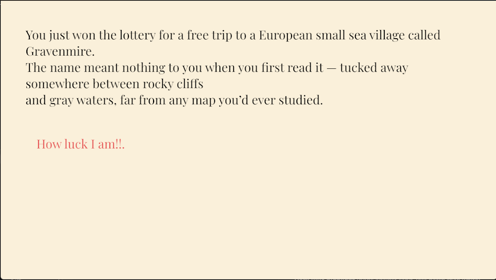

# Lost in Beach

Author: Alex Ding

Design: It is a choice_based game, you need to find a way out from the death trip from the calling of the beach, get inspiration from DND, I want to add some dice roll for sancheck if there are extra time for this assignment. (Hint: at least play 2 times game.)

Text Drawing: The game draws text at runtime using a “TextHB” utility that combines FreeType and HarfBuzz with OpenGL: the input string is shaped into glyph clusters with kerning and ligatures, each glyph is rasterized into a texture, and then textured quads are built and drawn in the shader at the current pen position, with wrapping handled separately

Choices: The game stores choices in a DialogueGraph, where each DialogueNode holds a block of dialogue text plus a list of DialogueOptions, and every option has a label (the player-visible text) and a pointer to the next node ID. These nodes are authored in plain text files with a simple format (start:, state:, text: <<< >>>, option: label -> next, endstate), which makes it easy to write branching narratives without touching code.

Screen Shot:

How To Play:

Mouth to control, left button click to make choice.

Sources: (TODO: list a source URL for any assets you did not create yourself. Make sure you have a license for the asset.)

Credit: jialand
reference: 
https://github.com/jialand/TheMuteLift/tree/main
https://github.com/arililoia-cmu/15-466-f23-base4
ChatGPT used to debug

Font website: https://fonts.google.com/specimen/Playfair+Display

This game was built with [NEST](NEST.md).

